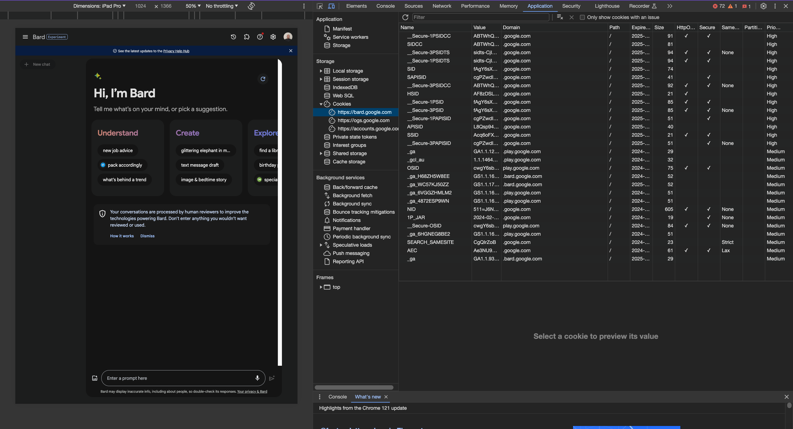
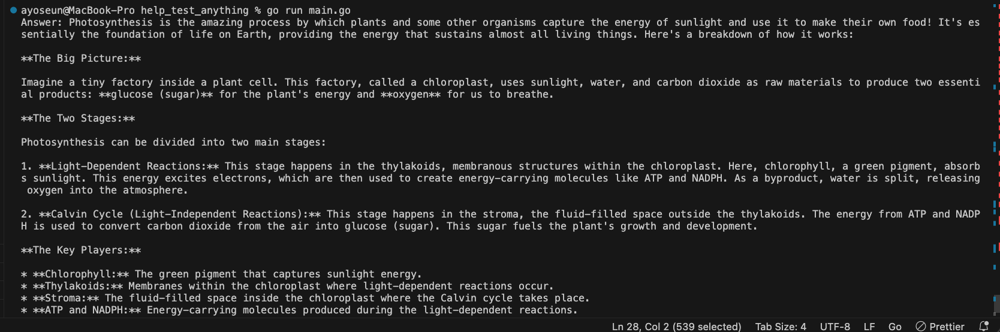
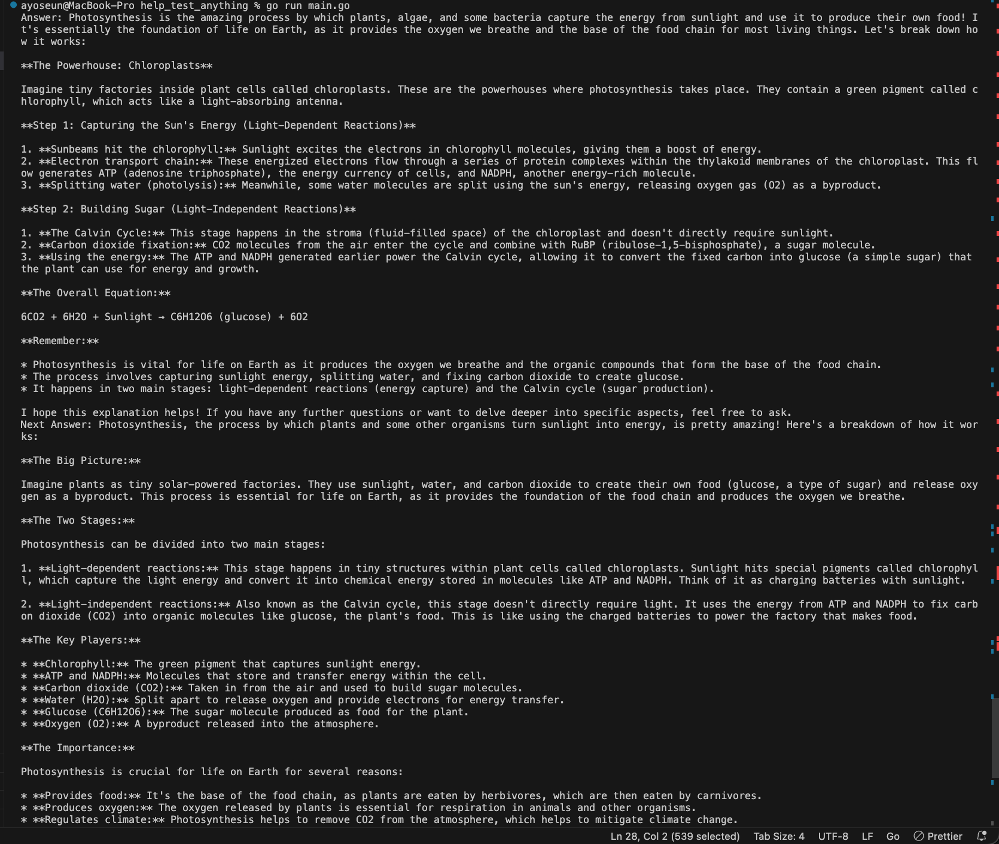

# GOBARD

GOBARD is a Go package that provides a convenient interface to interact with Google's Bard AI. It enables you to ask questions and receive answers from Google's Bard AI system. This package is designed to simplify the process of querying Bard by handling the intricacies of the underlying API.

## Table of Contents

1. Features
2. Installation
3. Configuration
4. Usage
5. Customization
6. Resources
7. Contribution
8. License


1.  ### Features

- Seamless Interaction: Provides a convenient interface to interact with the bard.google.com API.
- Intuitive Methods: Simple and intuitive methods for asking questions and retrieving answers.
- Answer Navigation: Support for navigating through multiple answers to a single question.
- Easy Integration: Designed for easy integration into your Go projects.


2. ### Installation

```shell
go get -u "github.com/aquasecurity/gobard"
```


3. ### Configuration
   To get started you need to first get your session cookies from your bard account
   Visit https://bard.google.com/ login with your google or email account.
   Press F12 or (fn F12 if you are a Mac user) or right-click and click inspect.
   Click the Application tab and select Cookies
  Copy the value of `Secure-1PSID` and `Secure-1PSIDTS`.

 > ATTENTION: Do not share your auth ==cookie==.



Create an instance of bard and paste your **Secure-1PSID and **Secure-1PSIDTS values in the <your __Secure-1PSID value> and <your __Secure-1PSIDTS value>

```go
b := bard.New("your __Secure-1PSID value", "your __Secure-1PSIDTS value")
```


4. ### Usage

- Send a simple bard prompt

```go
package main;

import (
	"fmt"
	"github.com/aquasecurity/gobard"

)

func main() {
	PSID := "<your __Secure-1PSID value>"

	PSIDTS := "<your __Secure-1PSIDTS value>"

	b := bard.New(PSID, PSIDTS)


	// Ask a question to Bard
	err := b.Ask("How does photosynthesis work?")
	if err != nil {
		fmt.Println("Error asking question:", err)
		return
	}

	// Retrieve and print the first answer
	answer := b.GetAnswer()
	fmt.Println("Answer:", answer)

}
```

`b` is a variable that holds the Bard instance. `b.Ask()` is used to send the prompt to Bard, while `b.GetAnswer()` retrieves the response from Bard AI.

- You can get more than one answer using NextAnswer()

```go
package main;

import (
	"fmt"
	"github.com/aquasecurity/gobard"

)

func main() {

   // PSID and PSIDTS represent the authentication values required for the Bard instance.
   PSID := "<your __Secure-1PSID value>"
   PSIDTS := "your __Secure-1PSIDTS value"

	b := bard.New(PSID, PSIDTS)

	// Ask a question to Bard
	err := b.Ask("How does photosynthesis work?")
	if err != nil {
		fmt.Println("Error asking question:", err)
		return
	}

	// Retrieve and print the first answer
	answer := b.GetAnswer()
	fmt.Println("Answer:", answer)

	// Navigate to the next answer
	b.NextAnswer()

	// Retrieve and print the next answer
	nextAnswer := b.GetAnswer()
	fmt.Println("Next Answer:", nextAnswer)

}
```

by calling b.NextAnswer(), bard adds another answer to your prompt


5. ### Customizations
   Gobard provides the following configurations

- Ask() - Ask asks a question to bard AI.
- GetAnswer()- GetAnswer returns the current answer.
- NextAnswer() - NextAnswer moves to the next answer and returns it.
- PrevAnswer()- PrevAnswer moves to the previous answer and returns it.
- GetNumOfAnswers() - GetNumOfAnswers returns the current number of answers.
- Next() - will continue the conversation using the first answer as a

which you can call from the instance of b := bard.New(PSID, PSIDTS), Each Bard object, from `bard.new()`, will have its own context until `Reset()` is called

- example

```go
package main

import (
	"fmt"
	"github.com/aquasecurity/gobard"
	"github.com/charmbracelet/glamour"
	"os"
)

var render *glamour.TermRenderer

func init() {
	render, _ = glamour.NewTermRenderer(
		glamour.WithAutoStyle(),
		glamour.WithWordWrap(80),
	)
}

func main() {
	// Environment variable retrieval for Bard initialization
	PSID := os.Getenv("__Secure-1PSID")
	if PSID == "" {
		fmt.Fprintf(os.Stderr, "__Secure-1PSID is not set\n")
		os.Exit(1)
	}

	PSIDTS := os.Getenv("__Secure-1PSIDTS")
	if PSIDTS == "" {
		fmt.Fprintf(os.Stderr, "__Secure-1PSIDTS is not set\n")
		os.Exit(1)
	}

	// Initializing Bard instance
	bardInstance := bard.New(PSID, PSIDTS)

	// Asking a question and displaying answers
	err := askQuestionAndDisplayAnswers(bardInstance, "Act as a simple calculator and calculate 2 + 2. Give the result only, no more words.")
	if err != nil {
		fmt.Println("Error:", err)
		return
	}

	// Customization Example: Use PrevAnswer() to go back and get the previous answer
	goBackAndRetrievePreviousAnswer(bardInstance)

	// Continuing the conversation using the first answer as a base
	bardInstance.Next()

	// Customization Example: Use Next() to continue the conversation using the first answer as a base
	bardInstance.Next()

	// Asking another question and displaying answers
	err = askQuestionAndDisplayAnswers(bardInstance, "What if I add 3 to the result?")
	if err != nil {
		fmt.Println("Error:", err)
		return
	}

	// Customization Example: Reset() to start a new conversation
	bardInstance.Reset()

	// Asking a new question in the new conversation
	err = askQuestionAndDisplayAnswers(bardInstance, "How does gravity work?")
	if err != nil {
		fmt.Println("Error:", err)
		return
	}
}

// Function to ask a question and display answers
func askQuestionAndDisplayAnswers(bardInstance *bard.Bard, question string) error {
	err := bardInstance.Ask(question)
	if err != nil {
		return err
	}

	// Displaying answers
	for i := 0; i < bardInstance.GetNumOfAnswers(); i++ {
		answerMD, _ := render.Render(bardInstance.GetAnswer())
		fmt.Printf("%s\n", answerMD)
		bardInstance.Next()
	}

	return nil
}

// Function to go back and retrieve the previous answer
func goBackAndRetrievePreviousAnswer(bardInstance *bard.Bard) {
	bardInstance.PrevAnswer()
	previousAnswer := bardInstance.GetAnswer()
	fmt.Println("Previous Answer:", previousAnswer)
}
```


- A practical use case of context management within the Bard package.When you call the Next() method, each invocation establishes a new context, allowing the Bard object to seamlessly transition to the next phase of the conversation using that prompt as a base.

```go

package main

import (
	"fmt"
	"os"
	"github.com/aquasecurity/gobard"
	"github.com/charmbracelet/glamour"
)

var render *glamour.TermRenderer

func init() {
	render, _ = glamour.NewTermRenderer(
		glamour.WithAutoStyle(),
		glamour.WithWordWrap(80),
	)
}

func main() {

	//  (Environment variable retrieval and Bard initialization)
	PSID := os.Getenv("__Secure-1PSID")
	if PSID == "" {
		mt.Fprintf(os.Stderr, "__Secure-1PSID is not set\n")
		os.Exit(1)
	}

	PSIDTS := os.Getenv("__Secure-1PSIDTS")
	if PSIDTS == "" {
		mt.Fprintf(os.Stderr, "__Secure-1PSIDTS is not set\n")
		os.Exit(1)
	}

	bard01 := bard.New(PSID, PSIDTS)

	// Asking a question and displaying answers
	err := bard01.Ask("Act as a simple calculator and calculate 2 + 2. Give the result only, no more words.")
	// ... (Error handling)

	// Displaying answers
	for i := 0; i < bard01.GetNumOfAnswers(); i++ {
		answerMD, _ := render.Render(bard01.GetAnswer())
		fmt.Printf("%s\n", answerMD)
		bard01.Next()
	}

	// Continuing the conversation using the first answer as a base
	bard01.Next()

	// Asking another question and displaying answers
	err = bard01.Ask("What if I add 3 to the result ?")
	// ... (Error handling)

	// Displaying answers
	for i := 0; i < bard01.GetNumOfAnswers(); i++ {
		answerMD, _ := render.Render(bard01.GetAnswer())
		fmt.Printf("%s\n", answerMD)
		bard01.Next()
	}
}
```

The use of the Next method in this code example emphasizes the concept of context management. Each call to Next signifies a transition to a new context, allowing the Bard object to maintain the flow of the conversation and respond intelligently to subsequent questions based on the context of the ongoing interaction.


6. ### Resources

   - This project utilizes:
     - "github.com/go-resty/resty/v2"
     - "github.com/tidwall/gjson"


7. ### Contribution

   Feel free to contribute by opening issues, providing feedback, or submitting pull requests. Your contributions are highly valued!


8. ### License
   
   This project is licensed under the Apache License, Version 2.0.
